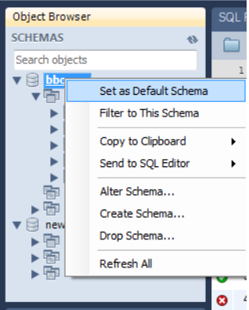

# [MySQL] Error code 1046

<br>

## 문제
MySQL WorkBench에서 테이블 생성할때, 위와 같이 에러가 남. 이 에러는 어떤 DB에 테이블을 만들지 지정해주지 않아서 나는 거래.

<br>

## 해결방법
테이블을 생성할 DB를 우클릭해서 Set as Default Schema로 설정함. 그럼 해결됨.


<br>

```
mysql command line에서 table생성할때
어떤 DB를 사용할지 권한을 먼저 줘야함

권한을 주고 나서 테이블을 만들때, DB이름은 적지 않아도 됨

권한을 준다는건 위와 같이 어떤 데이터 베이스를 사용할지
정하는 거임
```

<br>

```
< 권한 주는 방법 >
mysql> grant all privileges on DBName to userID@localhost identified by '비밀번호';

이러면 DB에 권한을 주게됨. 이 해결방안처럼 DB이름을 매번 적지 않아도 됨.
```

<br>
