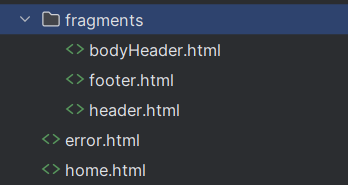

# 타임리프


## 타임리프가 뭔가
- 타임리프는 서버 측 JAVA template 엔진
- 요청 시 html 새로운 페이지를 만들어주는 '서버 사이드 렌더링' 방식
- 타임리프는 'natural templates'임, 타임리프 문법을 포함하는 html 파일을 서버 사이드 렌더링을 하지 않아도 실행됨
- 스프링부트는 JSP보다 타임리프 사용을 추천함

<br>


## 타임리프 공식문서 및 사용법

```
공식 문서
https://www.thymeleaf.org/doc/articles/layouts.html
```

<br>

### 타임리프 사용법 header & bodyHeader & footer
```js
<head th:replace="fragments/header :: header">
<div th:replace="fragments/bodyHeader :: bodyHeader"></div>
<div th:replace="fragments/footer :: footer"></div>
```

### 타임리프 디렉토리 및 html 위치



## 타임리프 라이브러리 추가
1. dependencies 추가
```java
implementation 'org.springframework.boot:spring-boot-starter-thymeleaf'
implementation 'nz.net.ultraq.thymeleaf:thymeleaf-layout-dialect'
```
2. 빌드(시간 걸리니깐 기다리기)
3. 재실행