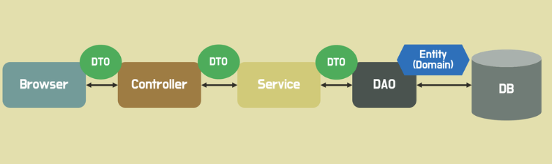

# ORM JPA MyBatis DTO
```
object relational mapping

어플리케이션과 DB 연결할때
SQL언어가 아니라 어플리케이션 개발 언어(JAVA)로
DB를 접근할 수 있게 해주는 툴
```

<br>

```
JPA
Java Persistence API
- java 진영에서 orm 기술 표준으로 사용하는 인터페이스 모음
- 자바 어플리케이션에서 관계형 DB를 하는 방식
- 인터페이스라서, Hibernate, OpenJPA 등이 JPA를 구현함
- 우린 JPA를 구현하기 위해, 해당 Hibernate 인터페이스를 사용하는 거임


myBatis
- 자바 어플리케이션에서 관계형 DB를 접근하는게 아니라,
Jdbc를 통해서 DB에 접근하고 작업을 캡슐화 해서,
일반 SQL 쿼리, 저장 프로시저 및 고급 매핑을 지원함.
모든 Jdbc 코드 및 매개변수의 중복 작업을 제거함.
- mybatis는 프로그램에서 sql 쿼리들을 하나의 구성 파일에 구성해서 프로그램 코드와 sql을 분리할 수 있는 장점이 있음
- 복잡한 쿼리나 다이나믹한 쿼리에 강함
- 반대로 쿼리를 남발해서 단점임
- 프로그램 코드와 sql 쿼리 분리는 코드 간결성, 유지보수 향상의 장점을 가짐
```

<br>

```
persistence
영속화
save
```

<br>


```
DTO
data transfer object
계층 간 데이터 전송을 위해서 도메인 모델 대신 사용하는 객체임.

계층은 controller, service, repository 등을 의미함.

----

DTO는 순수하게 데이터를 저장하고 데이터에 대한 getter, setter만 가져야한다고 함. DTO는 비즈니스 로직을 가져선 안됨. 저장 검색 직렬화 역직렬화 로직만 가져야함.

----

직렬화는 DTO를 byte, json, xml 등의 형태로 변환하는 것을 의미함. 역직렬화는 반대임.
근데 이게 자동으로 되나봐.
장고는 serializer가 필요햇는데 spring boot는 필요없더라
```

<br>