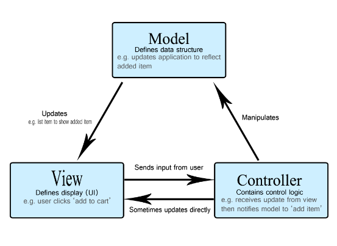

# MVC
```
핵심

model view controller
디자인 패턴 중 하나

사용자 인터페이스, 데이터 및 논리 제어를 구현하는데 사용하는
디자인 패턴임

'비즈니스 로직과 뷰를 분리'에 중점을 둔 디자인 패턴
```
### XML
```
XML객체는 서버와 상호작용할때 사용함.
XHR을 사용하면 페이지 새로고침없이도 URL에 데이터를 가져올 수 있음.
```

<br>
<br>
<br>

## MVC 개념
- model view controller
- 사용자 인터페이스, 데이터 및 논리제어를 구현하는데 널리 사용하는 SW 디자인 패턴
- SW 비즈니스 로직과 화면을 구분하는데 중점을 두고 있음
- 관심사 분리 : 더 나은 업무의 분리와 향상된 관리를 제공함

1. 모델 : 데이터와 비즈니스 로직을 관리
2. 뷰 : 레이아웃과 화면을 처리함
3. 컨틀롤러 : 모델과 뷰로 명령을 전달함

<br>
<br>
<br>


## 예시

- 쇼핑 리스트 앱이 있다고 상상해보자
- 우리가 원하는 건 이번 주에 사야할 각 항목의 이름, 개수, 가격의 목록임

<br>
<br>
<br>

### MVC를 사용해서 이 기능의 일부를 구현하는 방법
```
모델

모델은 앱이 포함해야할 데이터가 무엇인지 정의함
데이터 상태가 변경되면, 모델은 일반적으로 뷰에게 알림
가끔 컨트롤러에게 알리기도 함(업데이트된 뷰를 조절하기 위해 다른 로직 필요한 경우)

다시 쇼핑 리스트 앱으로 돌아가서, 모델은 리스트 항목이 포함해야 하는 데이터(품목, 가격, 등)과 이미 존재하는 리스트 항목이 무엇인지 지정함.
```

<br>


```
뷰

뷰는 앱의 데이터를 보여주는 방식

쇼핑 리스트 앱에서 뷰는 항목이 사용자에게 보여지는 방식을 정의함
표시할 데이터를 모델로부터 받음
```

<br>

```
컨트롤러

컨트롤러는 앱의 사용자로부터의 입력에 대한 응답으로 모델 또는 뷰를 업데이트하는 로직을 포함함

예로, 쇼핑 리스트는 항목 추가 혹은 제거를 위해 입력 폼과 버튼을 가짐. 이런 액션들은 모델이 업데이트되는 것이므로, 입력이 컨트롤러에게 전송. 모델을 적당하게 처리하고, 업데이트된 데이털르 뷰로 전송함
```

<br>
<br>
<br>

### 웹에서 MVC
```
웹 개발자로써, 이 MVC 패턴을 이전에 의식적으로 사용한 적이 없어도
상당히 친숙할 거임

데이터 모델은 아마 여러 종류의 데이터베이스에 포함되어 있을 거임
(mysql같은 전통 서버 사이드 데이터베이스, 
또는 indexedDB 같은 클라이언트 사이드 솔루션)

여러분의 앱의 제어 코드는 아마 HTML/JS로 작성되었을 것이고,
사용자 인터페이스는 HTML/CSS등 선호하는 것들로 작성될 것임
MVC와 유사하게 들리지만, MVC는 이런 컴포넌트들이 엄격한 패턴을 따르도록 함
```

<br>
<br>
<br>

### XMLHttpRequest
```
XMLHttpRequest XHR객체는 서버와 상호작용할때 사용함

!!!XHR을 사용하면 페이지의 새로고침 없이도 URL에서 데이터를 가져올 수 있음!!!

이를 활용하면 사용자 작업을 방해하지 않고, 
페이지 일부를 업데이할 수 있음

XHR은 AJAX 프로그래밍 할때 많이 사용함

XHR은 XML뿐만 아니라 모든 종류의 데이터를 가져올 수 있음
이벤트 데이터나 메시지 데이터를 서버에서 가져와야하는 통신의 경우,
eventSource 인터페이스를 통한 서버발 이벤트(server-sent event)의 사용을 고려하셈. 
완전한 양방향 통신의 경우 websocket이 더 나은 선택일 수 있음
```


<br>