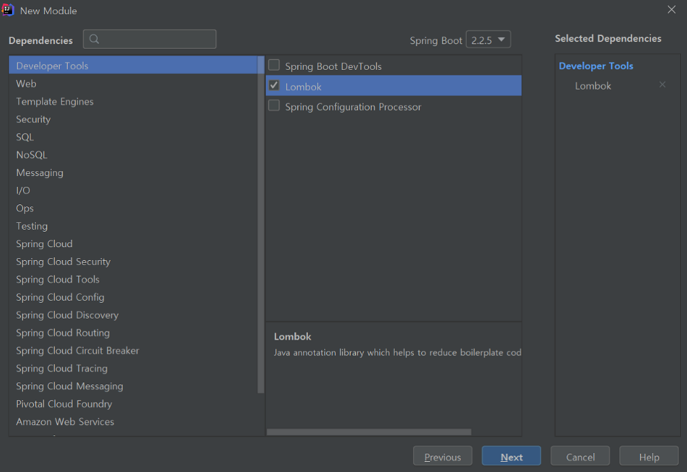
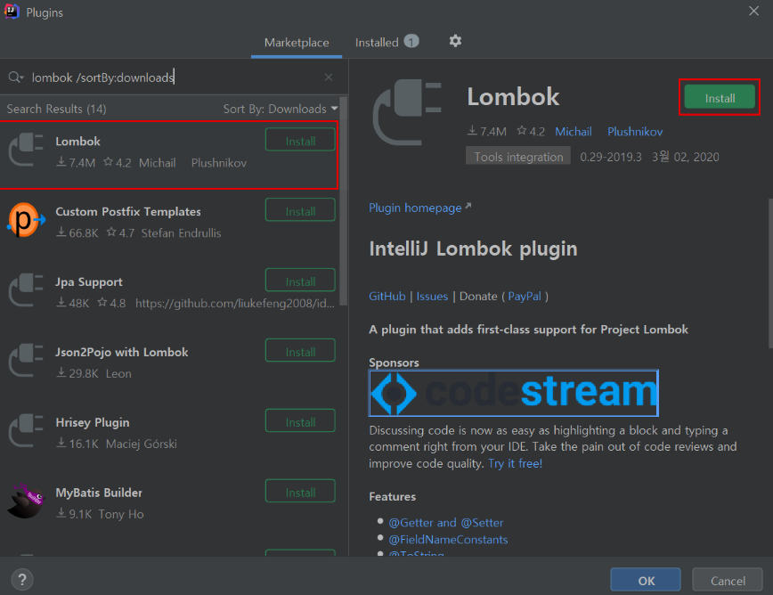
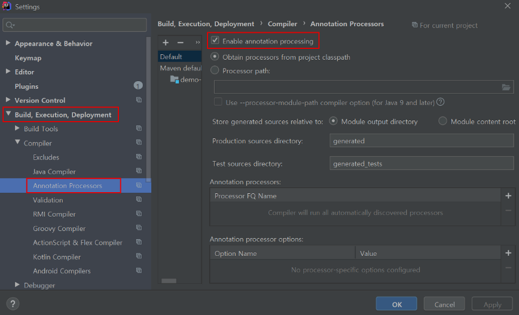

# lombok 라이브러리를 사용하기 위한 세팅 방법

```
lombok 라이브러리

lombok은 어노테이션을 이용해 컴파일 시점에 Getter, Setter, 생성자,
toString, Builder 등을 자동으로 만들어주는 라이브러리

개발자들이 필수로 사용하는 라이브러리 중 하나
```

<br>
<br>
<br>

# 1. Lombok 의존성 추가
### (1). spring intializer 사용


<br>

### (2). Gradle 사용
```java
dependencies {
    compileOnly 'org.projectlombok:lombok:1.18.12'
    annotationProcessor 'org.projectlombok:lombok:1.18.12'
}
```

<br>

### (3). Maven 사용
```java
<dependency>
    <groupId>org.projectlombok</groupId>
    <artifactId>lombok</artifactId>
    <version>1.18.12</version>
    <scope>compile</scope>
</dependency>
```

<br>
<br>

# 2. IntelliJ Lombok 플로그인 설치

File - settings - plugin - install

<br>
<br>

# 3. IntelliJ Annotation Processing 설정

File - settings - Annotation Processors검색 - Enable annotation processing 클릭

<br>
<br>
