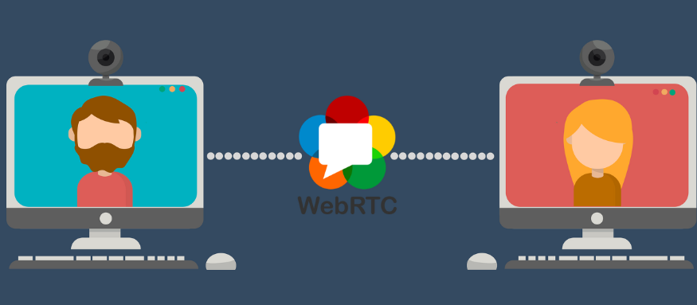
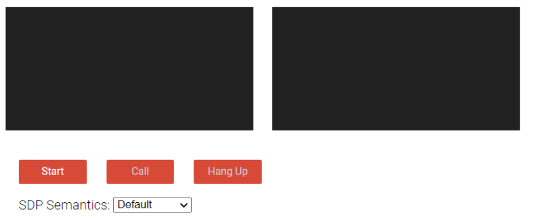
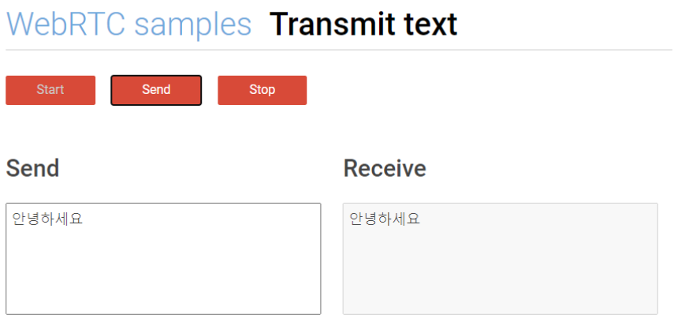

# webRTC

<br>

### webRTC 개념
- web real-time communication 
- 웹/앱에서 별다른 SW없이 카메라, 마이크 등을 사용하여 실시간 커뮤니케이션을 제공해주는 기술

- 우리가 잘 알고 있는 화상통화, 화상 공유 등을 공유할 수 있는 오픈 소스
- 비디오, 음성, 일반데이터가 P2P방식으로 지원함
- JS API로 제공함
- 사전 습득할 용어 및 개념
data streams, STUN/TURN servers, signaling, JSEP, ICE, SIP, SDP, NAT, UDP/TCP, network socket 등

<br>
<br>

### webRTC 장점
1. latency(지연시간)가 짧음
인스타 라이브 방송, 유튜브 라이브, 트위치 등 RTMP를 사용한 실시간 스트리밍은 지연 시간이 짧아야 실시간 방송이 가능함.
webRTC는 낮은 지연시간을 갖고, real-time 방송을 할 수 있음

<br>

2. 별다른 SW없이 실시간 커뮤니케이션이 가능함
웹/앱으로 방송을 키고 싶을때, 별도의 플러그인이나 미디어 송출 관련 SW를 따로 설치할 필요가 없음.

<br>

3. 개발하는데 진입장벽이 낮음

<br>

4. 무료임

<br>
<br>

### webRTC 단점
1. 크로스 브라우징 문제
- webRTC는 현재 chrome, opera, firefox 뿐 아니라 안드로이드, ios 등 브라우저, 앱에서 활용할 수 있음
- 그러나 사람들이 잘 사용하지 않는 브라우저나 최신버전을 사용하지 않은 사용자는 사용이 불가능함
- internet explorer는 지원하지 않음

<br>

2. STUN/TURN 서버가 필요함
- p2p통신을 하기 위해 사용자 IP주소를 알아야함
- 근데 대부분 방화벽 등을 사용하고, 다른 네트워크 상에서 연결이 이뤄기지 위해 STUN/TURN 서버가 꼭 필요함

<br>
<br>

### webRTC 동작 원리

```
P2P

위 그림처럼 한 컴퓨터와 다른 한 컴퓨터가 데이터를 주고 받는 형식임. 즉 동등 계층 간 클라이언트/서버 개념 없이 동등한 노드로 구성되어 데이터를 주고 받음
```

<br>
<br>

### webRTC smaple API
(1) 미디어 기기 시작하기
```java
async function init(e){
 try{
    const stream = await navigator.mediaDevices.getUserMedia(constraints);
    handleSuccess(stream);
    e.target.disabled = true;
 }catch(e){
    handleError(e);
 }
}

document.querySelector('#showVideo').addEventListener('click', e => init(e));
```
- media 기기(카메라 마이크)에 접근함
- alert로 마이크/카메라 허용/거부 등으로 permission이 뜸
- drawlmage()를 통해 순간 이미지를 저장할 수 있음
- 이미지에 filter를 씌울 수 있음
- audio만 단독으로 사용할 수 있으며, 녹화 기능도 됨

<br>

(2) RTC peer Connection

- 두 peer간의 안정적이고 효율적인 통신을 설정하고 관리함
- 신뢰할 수 없는 네트워크에서도 실시간 통신을 가능하게 함
- chrome, opera, firefox에서 지원함

<br>

(3) RTC data Channel

- peer 간 연결을 통해 데이터를 보냄
- text, file, data등을 전송할 수 있음

<br>

(4) other
- select source & outputs : 사용 가능한 오디오, 비디오 등이 여러개 있을때 선택할 수 있음
- stream capture: 재생하고 있는 비디오를 capture할 수 있음

<br>
<br>

### 알아야할 용어
```
[1] data streams
연결 지향 통신에서 연속적으로 흘러 나오는 데이터 흐름
데이터 양이 한정되어 있지 않고 끊임없이 생성되고 변하는 데이터 흐름임


[2] NAT(Network Address Translation)
NAT은 네트워크 주소 변환으로 IP패킷의 TCP/UDP 포트 숫자와 소스 및 목적지의 IP주소등을 재기록하며 네트워크 트래픽을 주고 받는 기술.


[3] signaling
시그널링은 P2P 통신이 일어나기 전(즉 데이터 전송 전)에
세션 제어 메세지, 네트워크 구성, 미디어 기능 등 정보를 교환하는데 사용함
- 세션 제어 메세지 : 통신 초기화하거나 통신을 닫고 오류를 보고함
- 네트워크 구성 : 외부 세계에 컴퓨터 IP주소와 포트는 무어인지 파악함
- 미디어 기능 : 브라우저와 통신하려는 브라우저에서 처리할 수 있는 코덱과 해상도는 무엇인지 파악함
- 시그널링은 P2P스트리밍을 시작하기 전에 성공적으로 완료되야함

[4] SDP
Session Description Protocol

[5] JSEP
JavaScript Session Establishment Protocol 제안/응답 아키텍처
```

<br>
