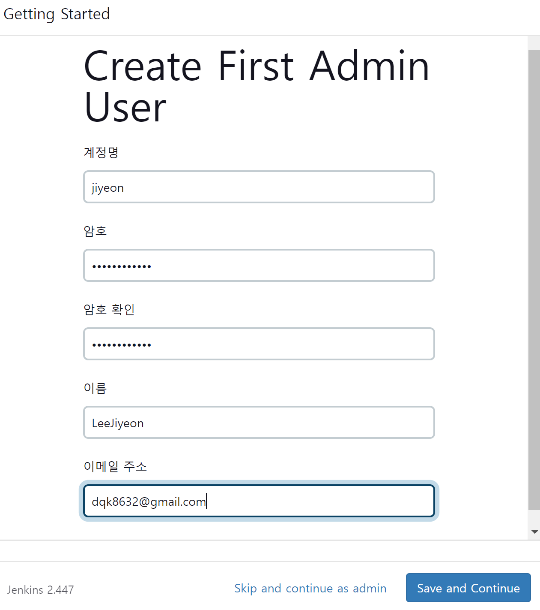

## Jenkins를 사용한 Blue Ocean 빌드 & 빌드 자동화

### 목차
1. Ubuntu 기본 환경 세팅
2. Docker 설치
3. Docker 컨테이너에 Jenkins 설치 및 진행
4. Jenkins 플러그인 설치 및 환경 설정
5. Gitlab 디렉토리에 Dockerfile 생성
6. 소스코드 push 후 수동 배포
7. Jenkins Build Triggers 설정
8. Gitlab에서 Webhook 설정


### 1. Ubuntu 기본 환경 세팅
```
$ sudo apt update
```
- 시스템이 새로운 소프트웨어를 설치하거나 업그레이드할때 가장 최신 정보를 사용할 수 있게 함
```

$ sudo apt upgrade
```
- 시스템에 설치된 모든 패키지를 최신버전으로 업그레이드함
- apt update를 통해 업데이트된 패키지 목록을 기반으로 현재 설치된 패키지들을 최신 버전으로 업데이트할 수 있음


```
$ sudo apt install apt-transport-https ca-certificates
```
apt-transport-https     
- https 프로토콜을 통해 안전하게 소프트웨어 패키지를 다운로드하고 설치할 수 있도록 도와주는 패키지
- https는 데이터 전송 중에 암호화를 제공하여 보안성을 강화함
ca-certificates
- 인증서(authority certificates)를 관리하는데 사용함
- https 통신 시 서버의 신뢰할 수 있는 인증서를 확인하기 위해 필요함


```
$ sudo apt install curl gnupg-agent software-properties-common
```    
curl   
- 데이터 전송을 위한 명령줄 도구    
- 다양한 프로토콜을 지원하며, 주로 웹에서 파일을 다운로드하거나 API 요청을 보내는데 사용함     

gnupg-agent   
- GNU privacy guard(GnuPG)의 에이전트 프로그램
- 암호화 및 서명 작업에 필요한 키관리를 지원함    

software-properties-common   
- 소프트웨어 소스 및 패키지 관리를 위한 공통 소프트웨어 속성을 제공하는 패키지
- add-apt-repository와 같은 유용한 명령어를 사용할 수 있게 됨


### 2. Docker 설치

docker의 GPG키를 다운로드해서 시스템 키링 파일로 변환하여 저장 ( 설치 및 업데이트 목적으로 사용 )
```
curl -fsSL https://download.docker.com/linux/ubuntu/gpg | sudo gpg --dearmor -o /usr/share/keyrings/docker-archive-keyring.gpg
```

docker를 설치하기 위한 APT 저장소(stable repository)를 시스템에 추가
```
sudo add-apt-repository "deb [arch=amd64] https://download.docker.com/linux/ubuntu $(lsb_release -cs) stable"
```
```
$(lsb_release -cs)
```
- 현재 ubuntu의 코드명을 반환하는 명령어
- ubuntu 버전에 따라 저장소 경로를 동적으로 생성함

패키지 목록 업데이트
```
$ sudo apt update
```

docker 설치
```
$ sudo apt install docker-ce docker-ce-cli containerd.io
```

docker 버전 확인
```
$ docker -v
```

clone your gitlab repository
```
$ git clone https://<your-repository>.git
```


#### GPG ERROR
```
GPG error: https://download.docker.com/linux/ubuntu jammy InRelease: The following signatures couldn't be verified because the public key is not available: NO_PUBKEY 7EA0A9C3F273FCD8
```
- GPG키 가져오기
- Docker APT 저장소에 대한 GPG 키 추가
- Docker APT 저장소를 다시 추가

#### Permission Denied
1. docker group 생성(있으면 있다고 해줌/없으면 생성해줌)
```
$ sudo groupadd docker
```

2. docker group에 해당 유저를 추가한다(현재 로그인 중인 유저를 추가하기)
```
$ sudo usermod -aG docker USERNAME
```

3. 로그아웃 후 다시 로그인 또는 명령어 실행시켜주면 적용이 됨.
```
$ newgrp docker
```

4. 도커 재시작
```
$ sudo service docker restart
```

5. 유저 로그아웃한 뒤에 다시 로그인한다. 
```
$ docker images
REPOSITORY TAG IMAGE ID CREATED SIZE
```


### 3. Docker 컨테이너에 Jenkins 설치 및 진행

#### docker 컨테이너에 jenkins 설치 후 구동(docker-compose로 진행 시 불필요함)
- `-u root` 옵션으로 실행하지 않으면 추후 진행 시 에러 발생함
```
sudo docker run -d \
	-u root \
	-p 9090:8080 \
	--name=jenkins \
	-v /home/ubuntu/docker/jenkins-data:/var/jenkins_home \
	-v /var/run/docker.sock:/var/run/docker.sock \
	-v /usr/bin/docker:/usr/bin/docker \
	jenkins/jenkins
```

```
# 실행 중인 container 조회
sudo docker ps

# 모든 container 조회
sudo docker ps -a
```

#### EC2 인바운드 규칙 추가
- tcp 9090포트로 인바운드 규칙 추가
- http://<퍼블릭 IPv4 주소>:9090 접속 후 admin password 입력
```
sudo cat ~/docker/jenkins-data/secrets/initialAdminPassword
```

### 4. Jenkins 플러그인 설치 및 환경 설정
#### jenkins 설치
- install suggested plugin 옵션을 선택해서 설치한다

#### jenkins 계정 생성 및 인스턴스 configuration

```
# 인스턴스 configuration 
http://탄력적IP:9090
```

#### jenkins credentials 설정
- github에서 personal access token 발급
```
https://blog.pocu.academy/ko/2022/01/06/how-to-generate-personal-access-token-for-github.html
```
- jenkins 관리 - system configuration - system
```
https://velog.io/@zayson/Jenkins-CICD-1.-GitHub-Repository-Clone%ED%95%98%EA%B8%B0
```
- jenkins location 입력


#### jenkins & github repository 연결 
1. add item
- name 설정
- pipeline 선택
- ok 누르기

2. jenkins pipeline 설정
- 스크립트 작성
```
pipeline {
    agent any 
    stages {
        stage('GitHub Repository Clone') { 
            steps {
                git branch: '브랜치이름', credentialsId: '토큰이름', url: '깃레퍼지토리 clone 주소'
            }
        }
    }
}
```

### 5. Gitlab 디렉토리에 Dockerfile 생성
### 6. 소스코드 push 후 수동 배포
### 7. Jenkins Build Triggers 설정
### 8. Gitlab에서 Webhook 설정
