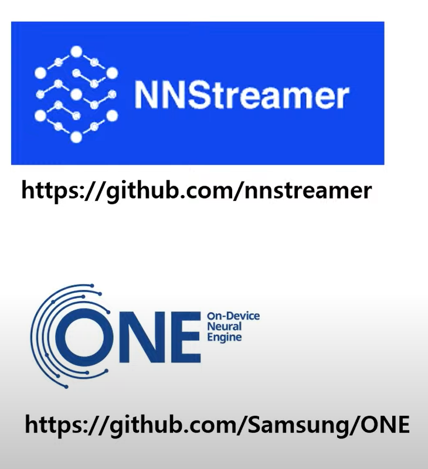
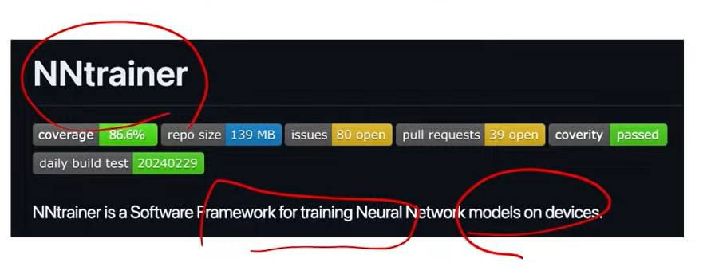
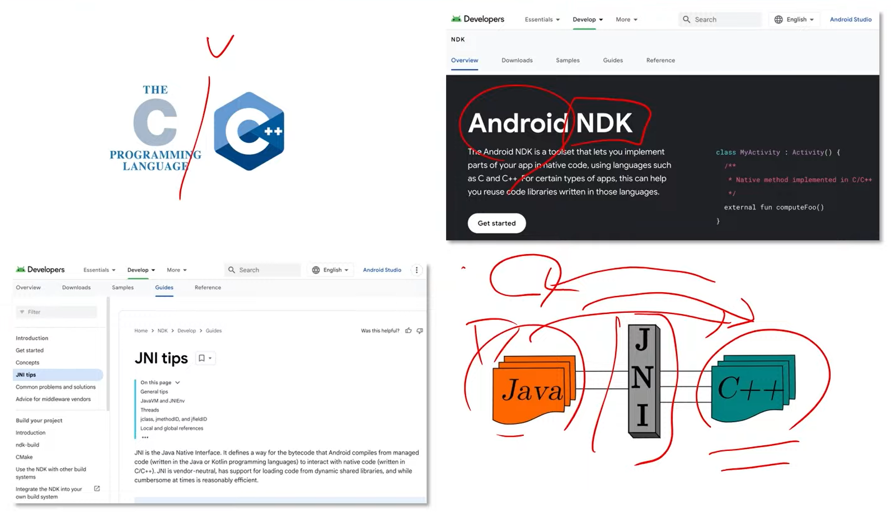
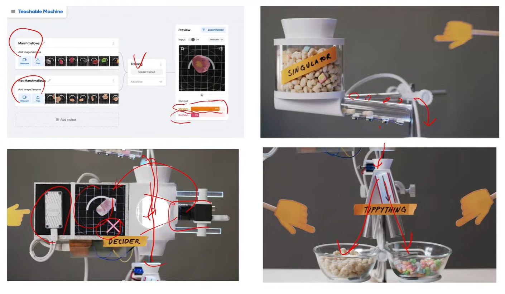

# on-Device AI

데이터 프라이버시
- 사용자 데이터 전송이 불필요함
- 기기 내부의 사용자 데이터를 직접적으로 이용하여 AI 모델을 실행함

네트워크
- 네트워크 오버헤드 제거
    - 사용자 데이터 전송에 따른 오버헤드를 제거함
    - 네트워크 연결 없이도 AI 동작함

클라우드 운영
- 클라우드 운영 비용 절감
    - 모델을 각 긱기에 배호함에 따른 클라우드 운영 비용 절감
    - 이산화탄소 배출량 감소

# on-Device AI 기술 기반 제품들
1. 삼성 갤럭시 S24 Ultra
    - 프로세서(CPU + GPU + NPU)
2. 자율 주행 기술
    - training은 클라우드의 고성능 GPU 서버를 사용함
    - inference는 device 자체에서 저전력의 NPU를 사용

# on-Device AI 기술을 SSAFY 팀프로젝트에 녹여낼 순 없을까
1. open source on-device ai 프레임워크 활용

2. ML on Android with MediaPipe and Tensorflow lite
- 이미 학습이 완료된 on-Device AI가 많음
- 그걸 프로젝트에 활용한 경우가 많음

3. google coral edge TPU
- 연산 속도를 가속화 하는데, CNN 연산 가속은 가능한데, RNN과 Transformer은 불가능함

### coral + teachable machine + raspberry pi프로젝트
